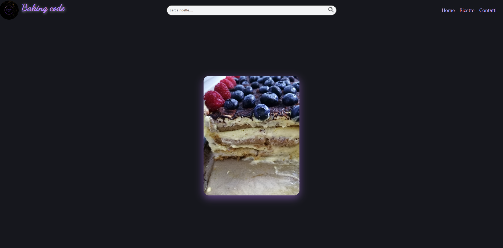
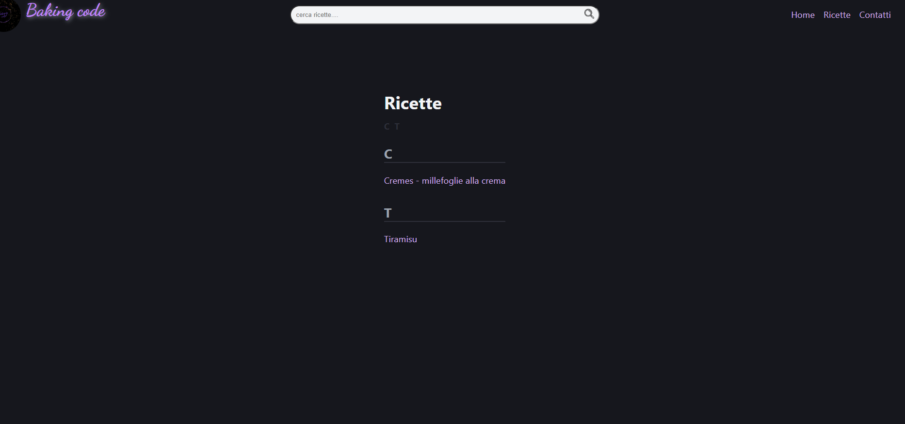
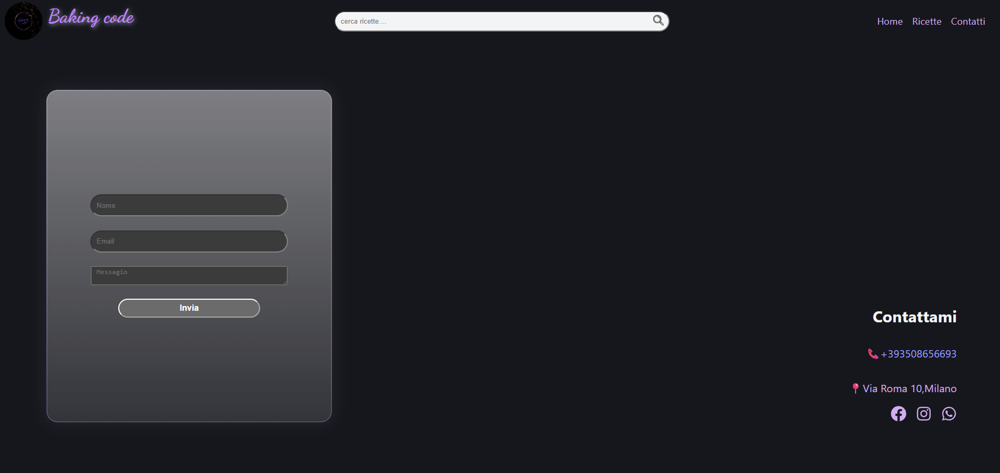

# Baking Code

Un sito web dedicato alle ricette di dolci, svilupato con React,pensato per presentare le mie ricette di dolci in modo semplice.

I contenuti vengono gestiti dinamicamente tramite Sanity CMS che permette di aggiungere facilmente nuove ricette attraverso un panello di amministrazione.

## 🚀Funzionalita'

- Gestione dinamica delle riette tramite Sanity CMS
- 🏠 Homepage con un carousel interattivo che mostra tutte le ricette
- 📖 Pagina "Ricette" con tutte le ricette ordinate alfabeticamente
- 📩 Pagina "Contatti" con modulo di contatto funzionante, numero di telefono, 📍indirizzo cliccabile con apertura diretta su Google Maps e link ai social
- Design responsive per dispositivi dektop e mobile

## Screenshoots

## Tecnologie Utilizzate

- React
- Javascript 
- Css
- Sanity CMS
- HTML

## Miglioramenti Futuri

- Inserire recensioni, commenti e valutazioni degli utenti

## Autore

Rus Daniela Rebeca